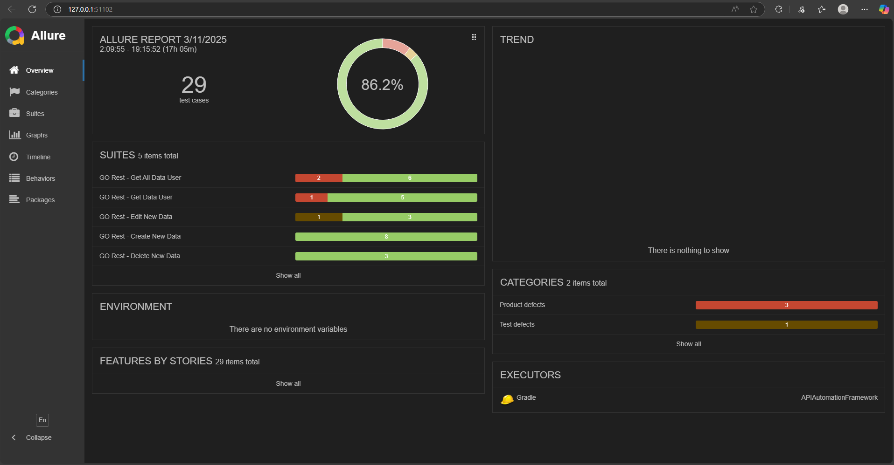

# Langkah-langkah Menjalankan Proyek

Berikut adalah panduan untuk menjalankan proyek API Automation Framework dari cloning repository hingga menjalankan pengujian menggunakan Gradle.

## Prasyarat
Sebelum memulai, pastikan Anda telah menginstal beberapa alat berikut di sistem Anda:
1. **Git**: untuk meng-clone repository
2. **Java JDK**: minimum versi 8 atau lebih tinggi
3. **Gradle**: untuk membangun dan menjalankan proyek
4. **IDE atau Code Editor**: disarankan menggunakan IntelliJ IDEA atau VS Code

## Langkah 1: Clone Repository
Langkah pertama adalah meng-clone repository proyek dari GitHub ke sistem lokal Anda.

```bash
git clone https://github.com/Lutfiesa/BelajarAPIAutomationFramework.git
```
Setelah cloning selesai, pindahlah ke direktori proyek:
```bash
cd BelajarAPIAutomationFramework
```
## Langkah 2: Set Up Proyek
Jika Anda menggunakan IntelliJ IDEA, buka proyek ini di IDE Anda:

1. Buka IntelliJ IDEA.
2. Pilih Open dan arahkan ke direktori APIAutomationFramework.
3. IntelliJ akan secara otomatis mengenali bahwa ini adalah proyek Gradle dan akan mengunduh semua dependensi yang diperlukan.

#### 
_Jika Anda tidak menggunakan IDE, Anda dapat menjalankan perintah berikut untuk memastikan semua dependensi Gradle terinstal:_

```bash
./gradlew build
```

## Langkah 3: Menjalankan Tes
Setelah konfigurasi proyek dan environment selesai, Anda dapat menjalankan tes dengan menggunakan Gradle.

Jalankan semua tes yang ada di proyek ini dengan menggunakan perintah berikut:
```bash
./gradlew test
```

## Langkah 4: Melihat Hasil Tes
Setelah menjalankan tes, Anda dapat melihat hasil tes di folder `build/reports/tests/test/index.html`. Buka file HTML tersebut di browser untuk melihat laporan pengujian dalam format yang mudah dibaca.

atau bisa menggunakan perintah dibawah :

```bash
allure serve .\build\allure-results\
```
####
**Allure Report**

